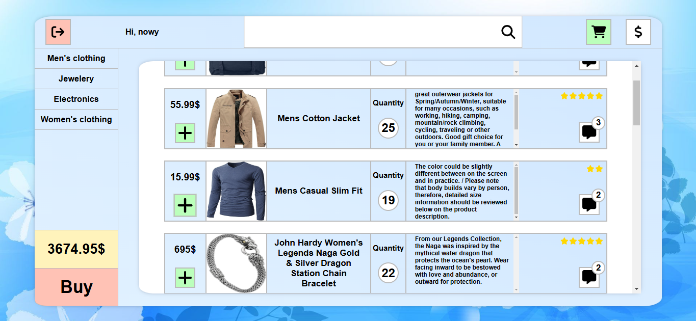

# ReactShop - Projekt Sklepu Internetowego

Witaj w projekcie ReactShop! Poniżej znajdziesz zrzuty ekranu z aplikacji, które pokazują jej główne funkcje i interfejs użytkownika.

---

## Zrzuty ekranu

### 1. Logowanie


---

### 2. Walidacja


---

### 3. Rejestracja


---

### 4. Strona produktu


---

### 5. Logowanie użytkownika


---

### 6. Rejestracja użytkownika



---

## Jak uruchomić projekt?

1. Sklonuj repozytorium:
   ```bash
   git clone https://github.com/twoja-nazwa-uzytkownika/reactshop.git
   Przejdź do katalogu projektu:
   ```

bash
Copy
cd reactshop
Zainstaluj zależności:

bash
Copy
npm install
Uruchom serwer deweloperski:

bash
Copy
npm start
Otwórz przeglądarkę i przejdź do http://localhost:3000.

Technologie

Frontend: React, Typescript

Backend: Node.js, Express, MongoDB

Autentykacja: JWT (JSON Web Tokens)

Inne narzędzia: Postman, Git, GitHub

Autor
Adrian Krawczyk
