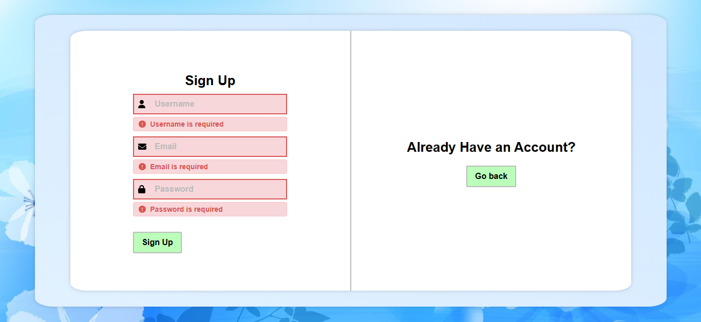
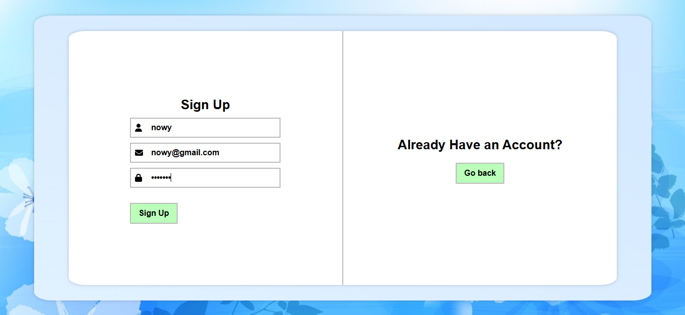
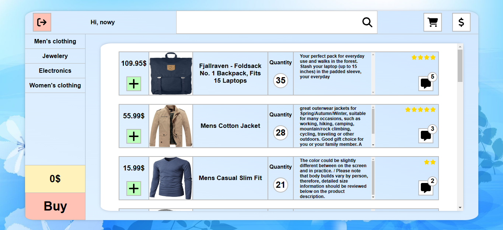
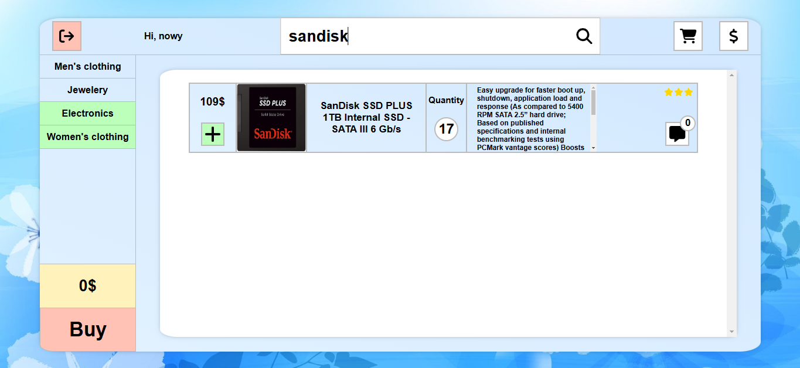
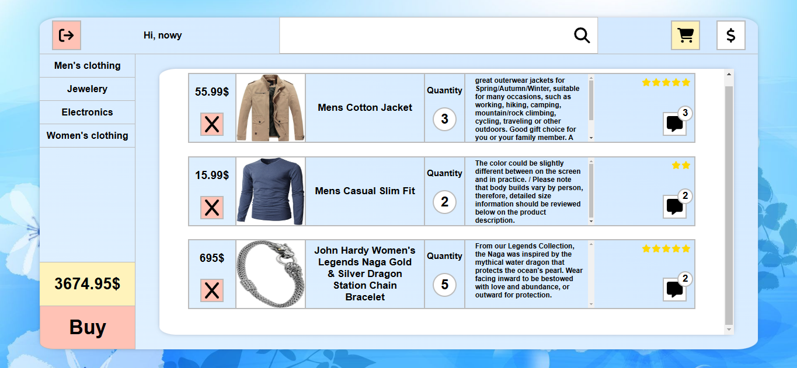
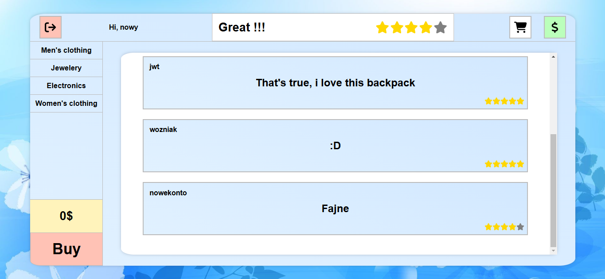
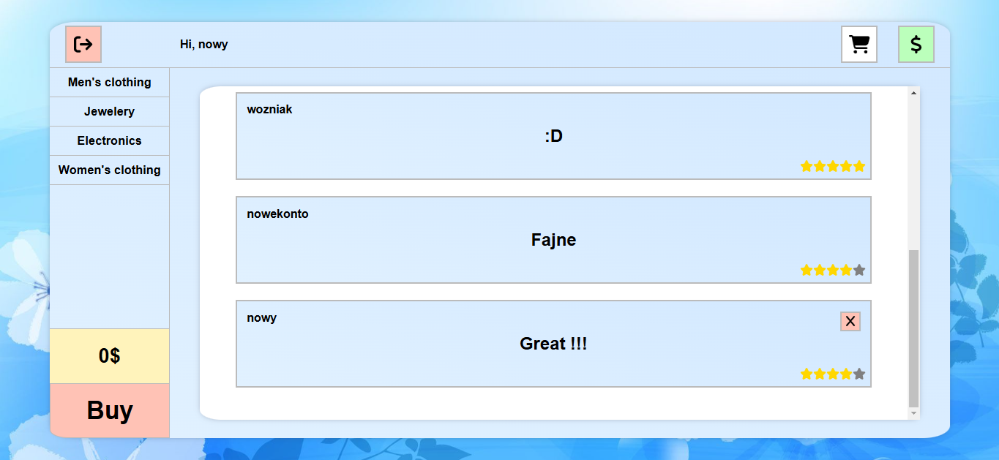

# ReactShop - Projekt Sklepu Internetowego na przedmiot Wprowadzenie do Aplikacji Internetowych 2024/2025.

Witaj w ReactShop! Poniżej znajdziesz zrzuty ekranu ze strony, które pokazują jej główne funkcje i interfejs użytkownika.

## Zrzuty ekranu

### 1. Logowanie


---

### 2. Walidacja



---

### 3. Rejestracja



---

### 4. Strona główna



---

### 5. Wyszukiwanie po kategorii i nazwie



---

### 6. Koszyk



---

### 7. Koszyk



---
### 8. Opinie



---

## Jak uruchomić projekt?

# Frontend

````
npm install
npm run dev
````

# Backend
````
cd server
nodemon index.js
````
## Technologie

# Frontend: React, Typescript

# Backend: Node.js, Express, MongoDB

# Autentykacja: JWT (JSON Web Tokens)

# Inne narzędzia: Postman, Git, GitHub

## Autor
# Adrian Krawczyk
