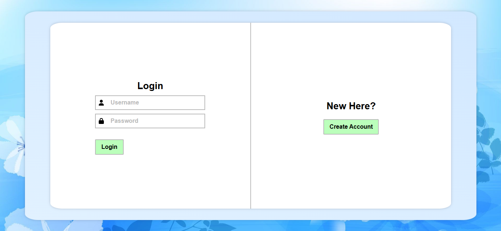

# ReactShop - Online Store Project for the Introduction to Web Applications Course 2024/2025.

Welcome to ReactShop! Below, you will find screenshots of the website showcasing its main features and user interface.

## Screenshots

### 1. Login



---

### 2. Validation


---

### 3. Registration


---

### 4. Home Page


---

### 5. Search by Category and Name


---

### 6. Cart


---

### 7. Reviews


---

### 8. Added Review


---

# How to Run the Project?

## Frontend

```
npm install
npm run dev
```

## Backend

```
cd server
nodemon index.js
```

## Technologies

### Frontend: React, TypeScript

### Backend: Node.js, Express, MongoDB

### Authentication: JWT (JSON Web Tokens)

### Other Tools: Postman, Git, GitHub

## Author
### Adrian Krawczyk
